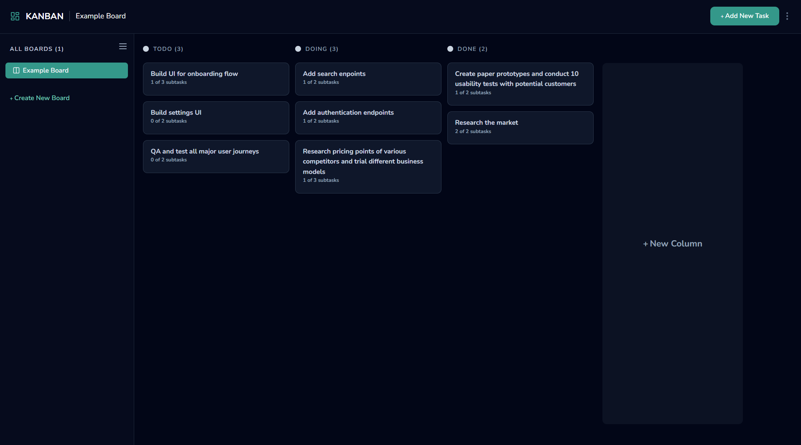
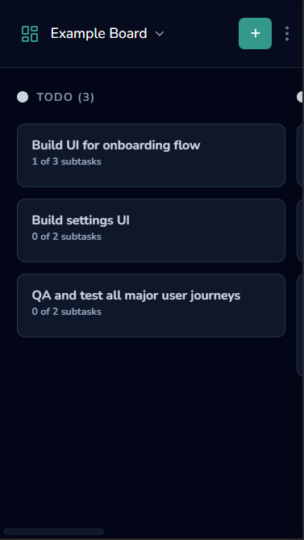

# Quick-Kanban

A simple kanban board, inspired by a [Frontend Mentor Challenge](https://www.frontendmentor.io/challenges/kanban-task-management-web-app-wgQLt-HlbB). This project was created with the primary goal of learning. Data gets stored in the local browser storage.

[Live Demo](https://fhir-questionnaire-graph.vercel.app/)

## Getting Started

### Prerequisites:

- node.js installed (https://nodejs.org/en/)
- dependencies installed (`npm install`)

`npm run dev` - to start development server  
`npm run build` - to build for production
